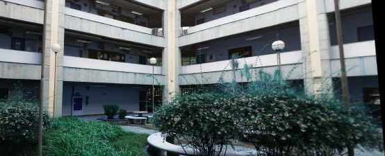

# Image-Mosaic

Algorithm that combines two images that have an intersection into a single mosaic image.

Example:

Image 1: 


Image 2:


Resultant Mosaic:



How to execute it:

```
python3 main.py --file1 img1.jpg --file2 img2.jpg
```


